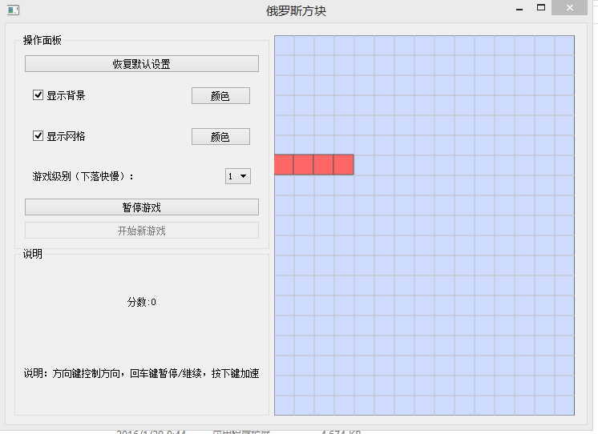
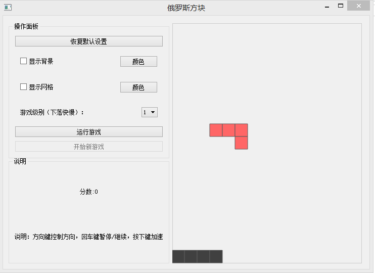
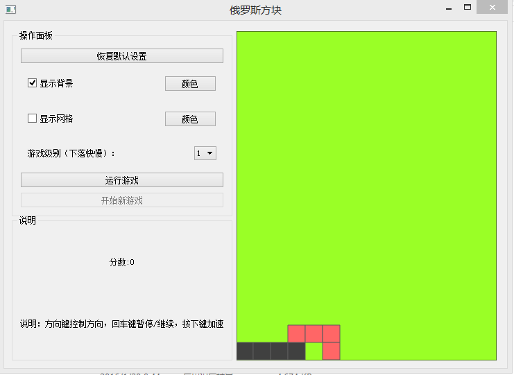
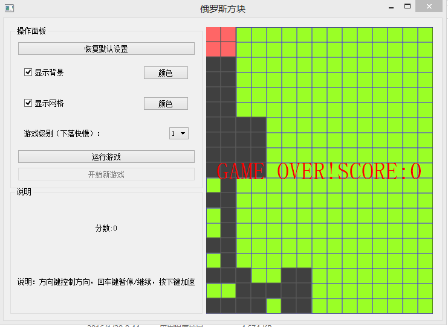

### qt版俄罗斯方块

#### 总体界面



上面有暂停游戏，开始游戏的按钮

#### 然后去除所有的背景和边框



#### 更换背景颜色



#### 更换线条颜色


#### 死亡



### 音效

这个游戏我加了两种音效，一种是循环播放的背景音效，使用的是`QMediaPlayer`和`QMediaPlayList`

*[需要注意的是，这里面使用的文件路径都是绝对路径]() *

使用的代码如下：

```
  QDir temp(".\\res\\back.mp3");
    QString absDir = temp.absolutePath();
    m_list = new QMediaPlaylist;
    m_list->addMedia(QUrl::fromLocalFile(absDir));
    m_list->setPlaybackMode(QMediaPlaylist::CurrentItemInLoop);
    m_list->setCurrentIndex(1);
    m_play->setPlaylist(m_list);
    m_play->play();
```

还有就是消行所产生的音效是QSound播放的wav格式的音频文件

```
QSound::play(":/res/b2b_continue.wav");
```

​	当然因为有两个线程都需要播放消行音效（一种是用户手动往下加速消行，一种是自然下落消行），所以不能直接调用上面的代码，我的做法是将这一行代码放在槽函数里面，然后该播放的地方发射信号，连接这个信号和槽使用跨线程方式

```
 connect(this, SIGNAL(deleteFinish()), this, SLOT(play()), Qt::QueuedConnection);
```


